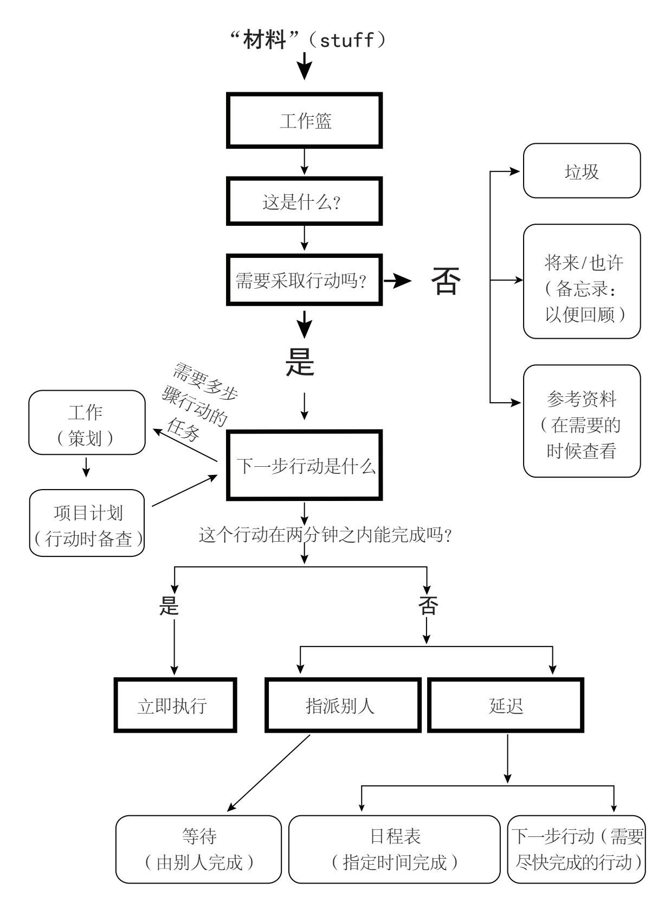

= 写下目前盘踞在你大脑中的重要的工作或状况

== 学车
* 学车 这个事情好繁琐，周期好长
** 了解具体的流程
** 打开app刷几道题

====
* 写论文 我不知道如何提笔
** 如果不知道写什么，先随便写tm10min！
** 写一个提纲
** 写一些细节
====

* 完成pxi汇款 每次找人签字就卡很久
** 找王旭光老师签字
** 送设备处盖章
** 去财务汇款

====
* 学习理财
** 陆金所购买
** 学习量化
** 如何开户
** 如何回测
** 完成定投策略
==== 

====
* 采购
** 买手机 这很困扰我
** 等待无息分期，如果没有，全款买
** 买合适的手套
*** 需要时间检索
* 想买qc35
** 但是我很少听歌了
====

* 找工作 
** 看看明天有哪些招聘会
** 打印几份简历

====
* 布置第一次现场
** 买往返的火车票
** 玫瑰花
** 小牙膏
** 口罩
** 照片墙
*** 我得先选出合适的照片
** 安全措施
** 润滑措施
====

* 给阿姨打电话，但是不知道该说些什么，或者是因为害怕她问起找工作的事

----
* asciidoc 代码折叠
** 需要时间检索
** 没有找到该功能
----

====
* 写写自己对冥想的感悟
** 冥想是断舍离和搞定的基础
** 冥想是治疗神经症的方法
** 冥想之后，呼吸平和了
** 把脑袋里的想法写出来，才是「不念过去，不畏将来」的最好实践
** 谢雨颖的烦恼
====

* airpods 一直掉线 找到原因 解决它
* 看看李凤仪的网线怎么接的
* 坐直的时候裆部好紧  解决它

====
* 看完<搞定>，找到工具链
** 如何清空大脑 如何和自己的想法相处
** 冥想+记录 让蜜蜂跑出来
** 意外中断怎么办
====

* autohotkey中能否识别正则表达式
左shift+数字  不切换输入法